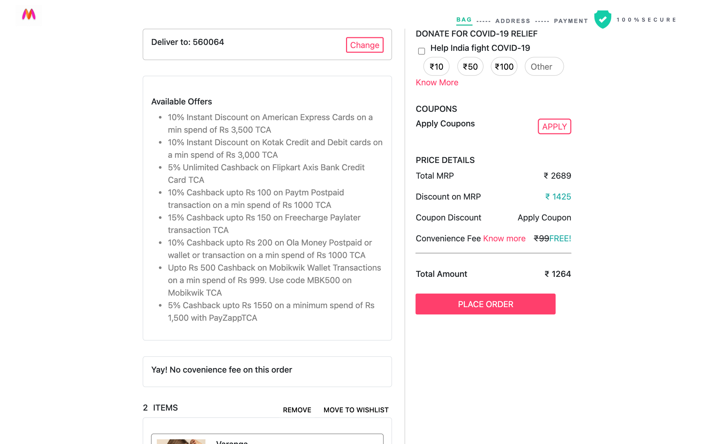
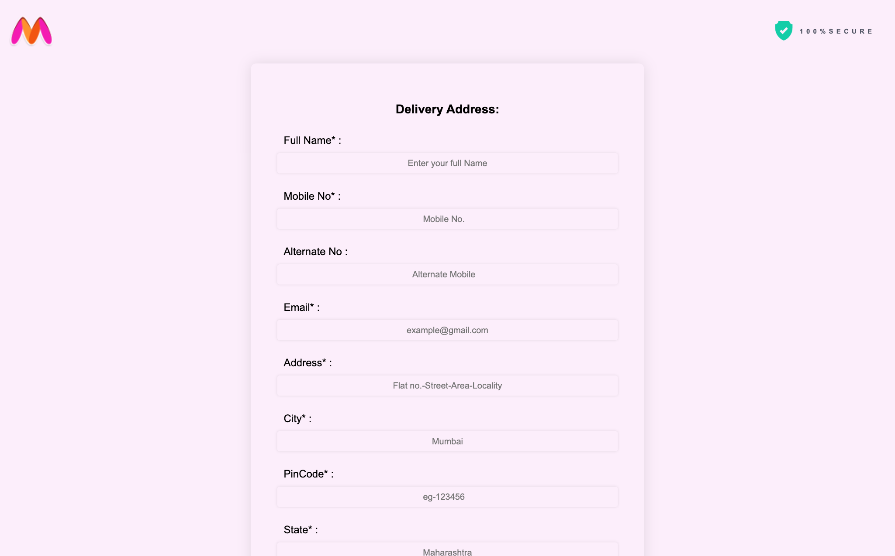
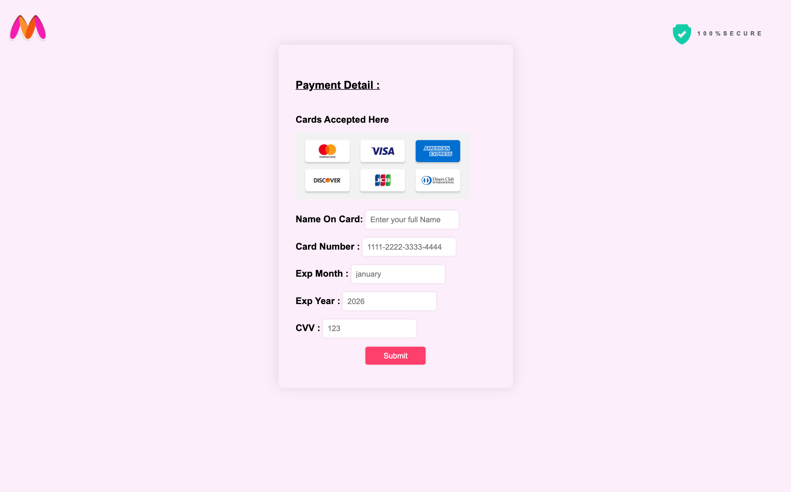

# Myntra Clone — Checkout Experience

[](https://s-harshni.github.io/Checkout-Experience-Optimization/)


<!-- live-links -->
> 🔗 **Live demo:** [s-harshni.github.io/Checkout-Experience-Optimization](https://s-harshni.github.io/Checkout-Experience-Optimization/)  
> 👤 **Portfolio:** [s-harshni.github.io/S-Harshni](https://s-harshni.github.io/S-Harshni/)  
<!-- live-links -->

A front-end clone of the Myntra fashion store focused on the **shopping-to-checkout journey**: browse, filter and sort products, add them to the bag, then go through the address → payment → order-confirmation steps. Built with plain HTML, CSS and JavaScript; cart, wishlist, address and payment state live in `localStorage`.


## Features

- **Home page:** mega-menu navigation, sliding banners, deal and brand carousels
- **Product listings** (women's tops, men's t-shirts): product cards with price, MRP and discount
  - **Sort:** recommended, what's new, popularity, discount, price high→low / low→high
  - **Filter:** brand (built from the product data), price range, minimum discount, combinable with sorting
  - **Add to bag** and **wishlist** on every card, with live bag and wishlist counters
- **Bag:** item list, remove / move to wishlist, price details (MRP, discount, total), coupon and donation widgets
- **Checkout:** delivery-address form → payment form → order confirmation
- **Accounts:** sign-in / sign-up / OTP screens (front-end only)

## Screenshots

| Listing with filters | Bag |
|---|---|
|  |  |

| Address | Payment |
|---|---|
|  |  |

## Run locally

No build step is needed. Serve the `final/index` folder with any static server:

```bash
git clone https://github.com/S-Harshni/Checkout-Experience-Optimization.git
cd Checkout-Experience-Optimization/final/index
python3 -m http.server 8000     # then open http://localhost:8000
```

## Project structure

```
final/index/        the finished storefront (deployed to GitHub Pages)
  index.html          home page
  kurtawomen.html     women's tops listing      tshirt.html   men's t-shirts listing
  filters.js          brand / price / discount filters shared by both listings
  bag.html            bag + price details        wishlist.html
  Daddress.*          delivery address           Dpayment.*    payment
  Dcart.*             order confirmation          signin / signup / otp
Address/, Payment/, SuccessfulOrder/, myntralandpage/, navbar/, footer/, rohit/
                    individual team members' working drafts
```

## Fixes in this version

The storefront had several bugs that stopped the checkout journey from working:
- **No way to add items to the bag.** The add-to-bag handler was commented out, so every card now has an *Add to bag* button.
- **Filters threw errors.** The filter code targeted brand/colour IDs that didn't exist, and the first missing element aborted the rest of the script. It's replaced by a working brand / price / discount filter (`filters.js`).
- **An empty bag crashed the bag page** (`JSON.parse(null).reduce`).
- Wrong-case asset names (`DAddress.css`) broke the address page on case-sensitive hosting, and placeholder `href="/"` links left the site. Missing header images were replaced.
- Added GitHub Actions deployment to GitHub Pages (the previous Netlify deployment is offline).

## Credits

Originally built as a team project, **team8_Myntra_clone_project**, by Hariom Tripathi, Chirag Arora, Rohit Kumar Gupta, Shubham Sharma and Md Dilnawaz Alam (see [`team.txt`](team.txt)). Product images are loaded from Myntra's public CDN for demonstration only. This is a learning project, not affiliated with Myntra.

## Author

**S Harshni** · [Portfolio](https://s-harshni.github.io/S-Harshni/) · [LinkedIn](https://www.linkedin.com/in/ks-harshni/) · [GitHub](https://github.com/S-Harshni)
